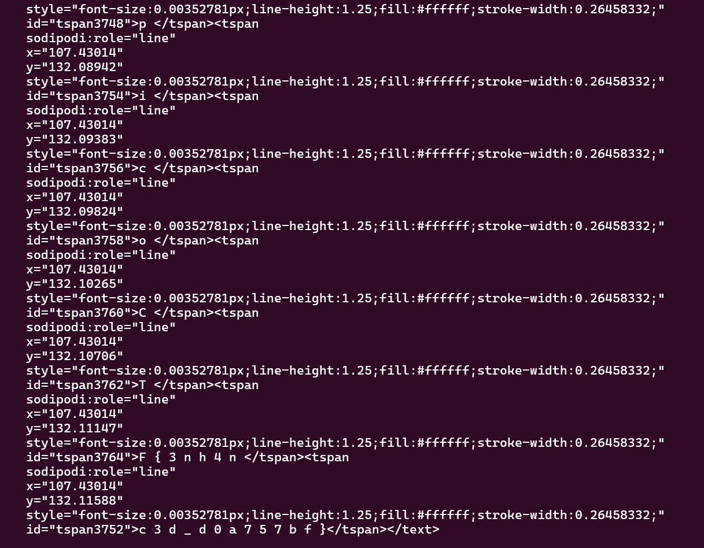
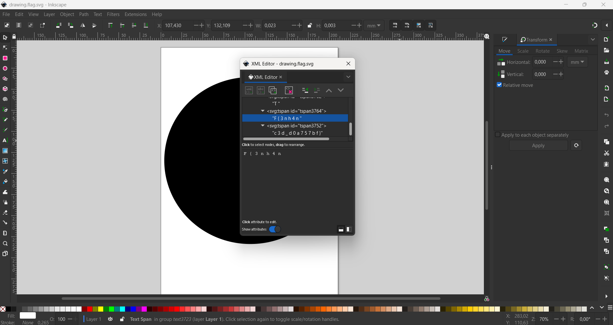

# 

## Description

Download this image file and find the flag.

## Attachments

[Download image file](additional-files/drawing.flag.svg)

## Solving Steps

### Step 1 (Analyzing the metadata of the SVG)

After downloading the SVG, opening it just showed a large black circle with a small white circle in the middle. My first instinct was to check the metadata for more clues.</b>
 

Using <b>exiftool</b> on the SVG and scrolling to the very bottom, we can see multiple lines of what seems to be texts indicated by <b>tspan</b>. There are a total of 8 lines and if you combine the text inside of each of them together they spell out the flag: <b>picoCTF{3nh4nc3d_d0a757bf}</b>

## Alternatives

You can also get the flag by going into <b>Inkscape</b> and check for hidden layers. This particular challenge's flag can be found in the <b>XML editor</b> by using the keys <b>Ctrl+Shift+x</b>. This is how I found the flag but I realized that exiftool was enough to get the flag, I just didn't saw the text lol.

