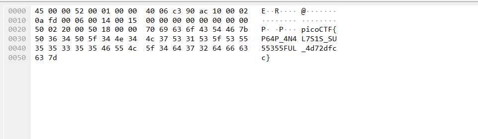

# 

## Description

How about some hide and seek heh? 
Download this file and find the flag.

## Attachments

[Download pcap file](additional-files/trace.pcap)

## Solving Steps

### Step 1 (Figuring out how to use Wireshark)

I have no idea how to use Wireshark. So I got to learning some commands that I can use in Wireshark to possibly find the flag. After searching, I came across the <b>find tool</b>. I used this tool to find packets containing the string <b>picoCTF</b> and sure enough something appeared.
 

## What I learned

I learned about the find tool and how to use it in Wireshark.

