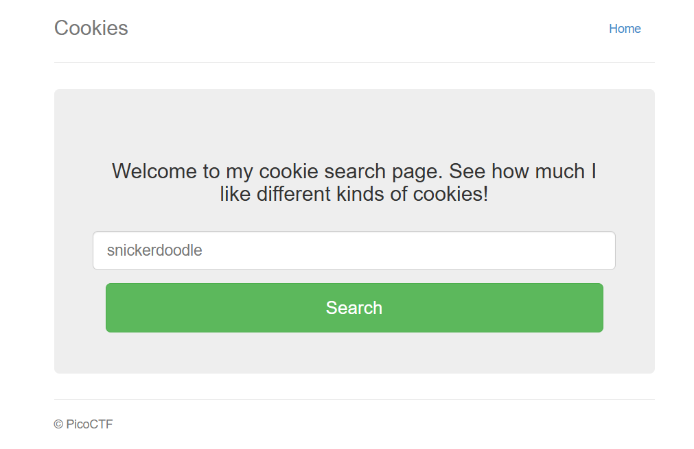
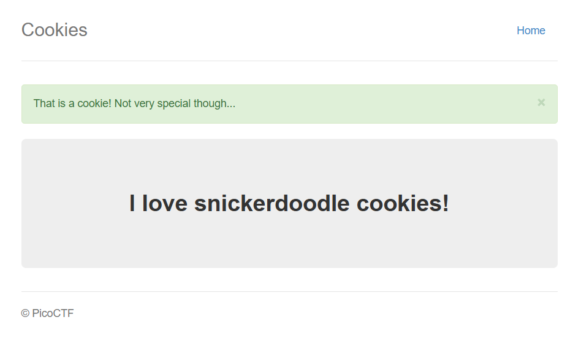
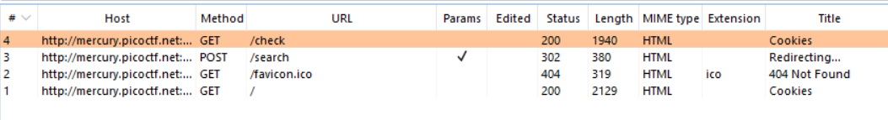
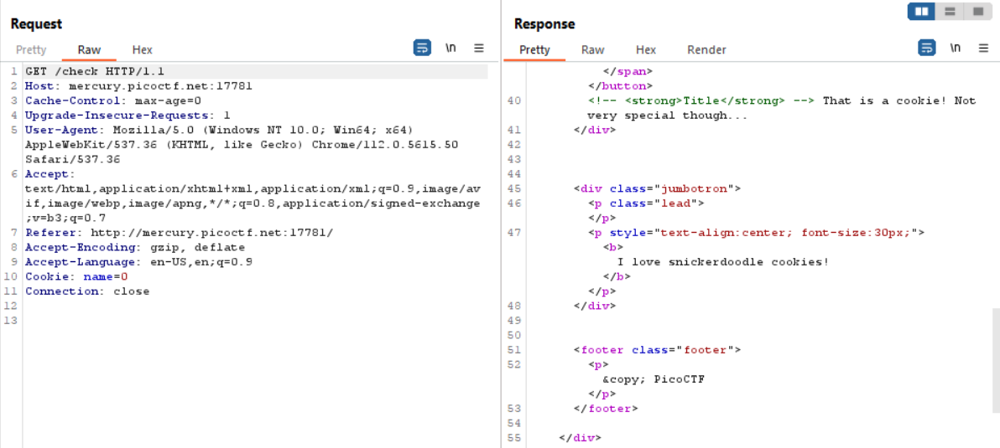

# 

## Description

Who doesn't love cookies? Try to figure out the best one. http://mercury.picoctf.net:17781/

## Solving Steps

### Step 1: Learn how the Website Works

---

The website is a simple search website. It tells the user to input a type of edible cookie, checks if that type of cookie is stored in the database or not, and if it does it'll display how much the author loves said cookie.

---

As you can see here, I inputted snickerdoodle and it tells us about how much the author love snickedoodle cookies. However, it's not very special.

---

Here are the things happening on the website according to burp suite. We know that the website searches for the type of cookie we inputted and display the result in /check

---

What's interesting is that in the /check request, there's a variable named "Cookie". Inside of this "Cookie" variable is an integer which I assume indicates the index of the type of cookie on the database. This means we can search for the flag through this by inputting integers one by one until we find a response containing the flag.

---

### Step 2: Use Burp Suite Intruder to Automate the Process

---

Burp Suite also has another handy tool called "Intruder". It allows users to automate customized attacks against web applications. Let's say you need to input 100 different numbers or dates or any other combinations in order to find the flag. You can do this using Burp Suite's Intruder.

---

After setting up the intruder using the check request from earlier, all we need to do is find the response that contains the string beggining with "picoCTF{". We finally get that the flag is the 18th index in the database and it's:

**`picoCTF{3v3ry1_l0v3s_c00k135_bb3b3535}`**

---

### What I Learned

Through this challenge, I learned how to examine a website and its inner workings in order to find vulnerabilities within it. I also learned how to operate Burp Suite's Intruder feature which might come in preetty handy in the future.
