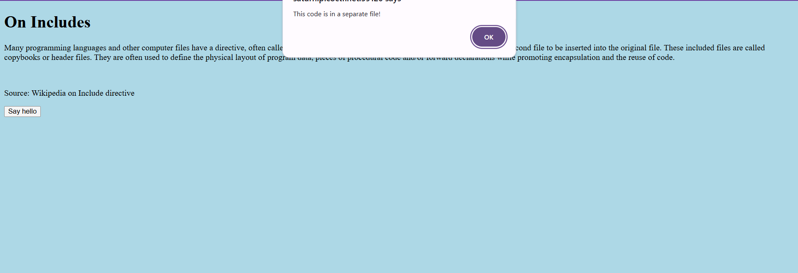
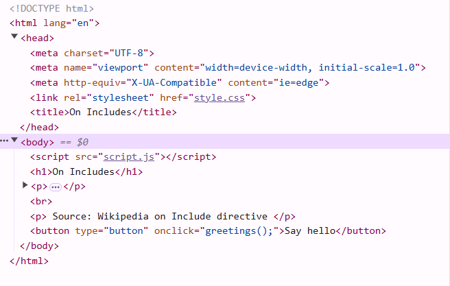

# 

## Description

Can you get the flag?
Go to this website and see what you can discover.

## Hints

- **Is there more code than what the inspector initially shows?**

## Solving Steps

### Step 1: Learn how the Website Works

The website is a simple webpage that talks about what an include is. Other than that, there's a "say hello" button that alerts the user that the code is in a seperate file.

---

### Step 2: Learn what a include is

If I'm not mistaken, an include is another file that is referenced in a file. For example: a javascript or css file that is reference in an HTML file.

---

### Step 3: See the HTML file's code

Using inspector mode, we see that the HTML file references a css file (style.css) and a javascript file (script.js). We can go to each of these files through the network bar. Turns out, the css file contains the first part of the flag and the javascript file contains the second part of the flag.

**`picoCTF{1nclu51v17y_1of2_f7w_2of2_df589022}`**

---

### What I Learned

I learned how to analyze files that are referenced in an HTML file.
