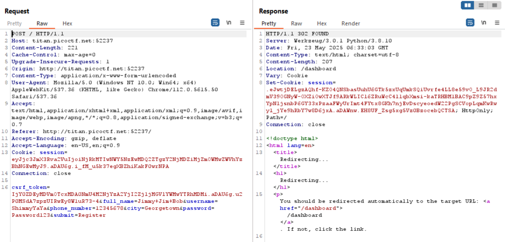
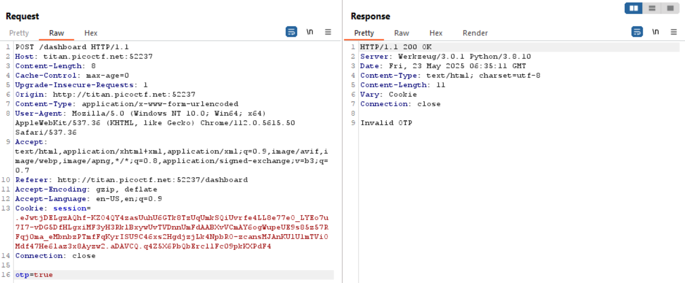
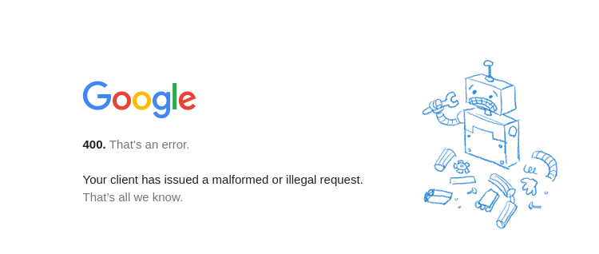
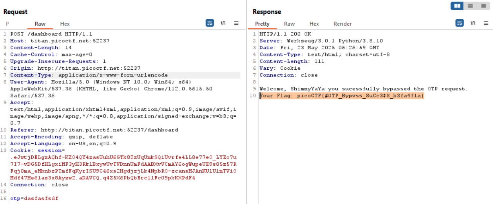

# 

## Description

Try here to find the flag.

## Hints

- **Try using Burp Suite to intercept request to capture the flag.**
- **Try mangling the request, maybe their server-side code doesn't handle malformed requests very well.**

## Solving Steps

### Step 1: Learn how the Website Works

Upon booting up the instance, we end up in a registration page. After registering, it will redirect us to a 2FA (Two Factor Authentication) page that asks us for an OTP (One Time Pad). Unfortunately for us, we do not know what this OTP is and any guess made will be rejected by the website.

---

### Step 2: Use Burp Suite to Intercept the Request

Burp Suite is a software/tool used to conduct penetration testing towards web applications. If you want to find vulnerabilities on websites, you would use Burp Suite. One handy function on Burp Suite is the ability to intercept requests made in the website so that we can analyze what's happening and even modify it.

---

First, I used Burp Suite to intercept the registration request but I found nothing that could seem malicious.

---

Next, I intercepted the request for the 2FA. There's a variable called `otp` at the bottom of the request. I tried changing the values to `"true"` or `"1"` or any indication of the OTP being valid, but it did not seem to work.

---

Then, I saw the hint. The hint talked about something called malformed requests. I Googled up what a malformed request was and it led me to [this website](https://developer.mozilla.org/en-US/docs/Web/HTTP/Reference/Status/400). To put it simply, a malformed request is a request that results in an error — may it be because of a missing letter, incorrect format, etc.

---

All I needed to do now was delete a random letter from the request and forward it back to the website. Doing this will give you the flag:

**`picoCTF{#0TP_Bypvss_SuCc3$S_b3fa4f1a}`**

---

### What I Learned

I'm not 100% if this is the correct explanation but here it goes. From this challenge I learned that some websites have middlewares that check properly structured requests. However, in this case, we malformed that request which allows us to confuse the middleware and bypass it.

In order to counter this attack, we must put request validation before the middleware to check beforehand if the request is properly structured or not.
