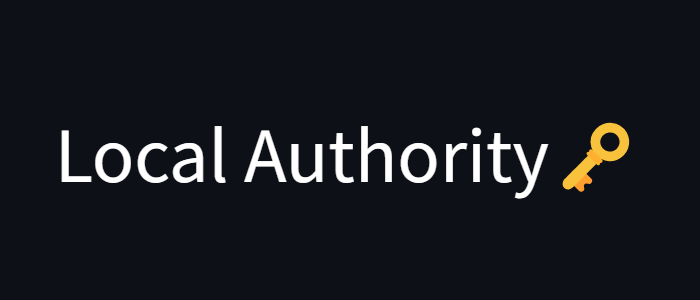
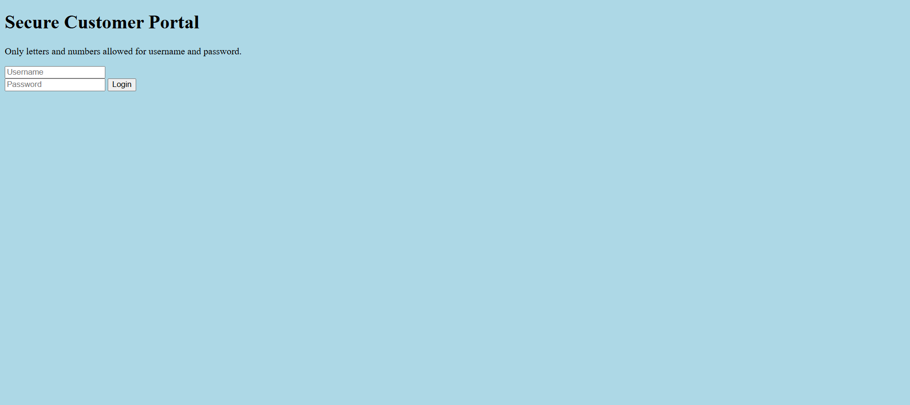
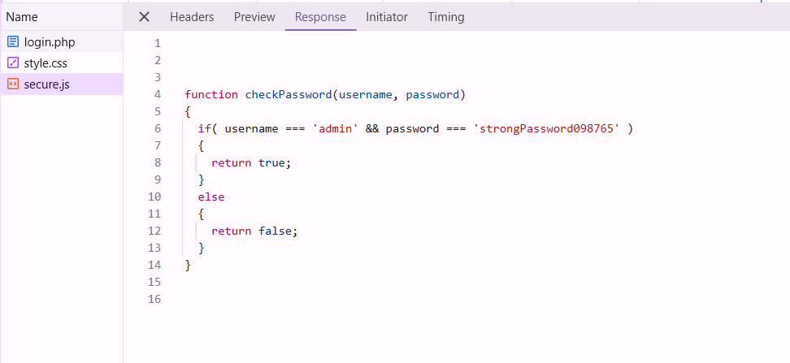

# 

## Description

Can you get the flag?
Go to this website and see what you can discover.

## Solving Steps

### Step 1: Learn how the Website Works

---

Alright, it seems like a normal login page. Upon opening inspector mode, there doesn't seem to be a javascript file yet. In that case, lets try to login with a random username and pass and see what happens.

---

As expected, the results show that the login failed. But since we moved to a new page, lets try opening up inspector mode to see if there's anything interesting.

---

There seems to be a javascript file named secure.js which ironic because it's not secure. Opening this file would result in a username and password checking code. It says that if your username is "admin" and the password is "strongPassword098765" then it'll return true which I assume is us going to the page that contains the flag.

---

### Step 2: Login with the credentials

---

With this in mind, let's try to login using the credentials we got before. Sure enough, we got to the page that contains the flag.

**`picoCTF{j5_15_7r4n5p4r3n7_a8788e61}`**

---

### What I Learned

I learned how to analyze javascript code to find vulnerabilities in the website.
